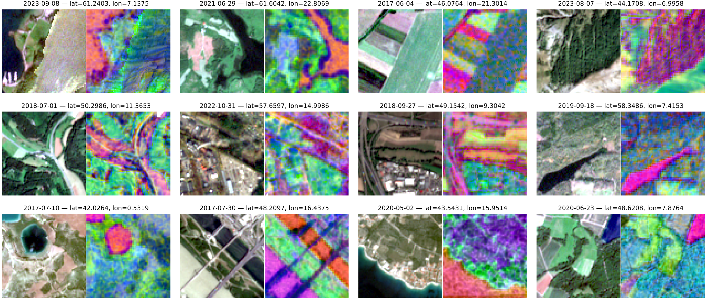

# Feature Cube Module

This module contains the scripts for generating and inspecting the latent feature cubes used in the downstream workflows.
The main output of this module is a feature cube stored as a `.zarr` dataset. 
These cubes are created from the trained representation models and are later used, for example, in the GPP use case.

## Scripts

### 1. Feature cube extraction

Execute [`feature_cube_torch.py`](feature_cube_torch.py). The script supports argparse-based runtime configuration.

Example CLI command:

```bash
python feature_cube_torch.py \
  --cuda-device cuda:1                                             # GPU used for inference \
  --batch-size 128                                                 # Number of patches per forward pass \
  --base-path /net/data_ssd/deepfeatures/trainingcubes             # Input directory of the Sentinel-2 base cubes \
  --merged-path /net/data_ssd/deepfeatures/s1_s2_cubes             # Cache directory for merged Sentinel-1/2 cubes \
  --output-path /net/data_ssd/deepfeatures/sciencecubes_processed  # Output directory for the final feature cubes \
  --checkpoint-path ../checkpoints/fusion/fuse_model.ckpt          # Fusion checkpoint used for feature extraction \
  --processes 4                                                    # Worker processes for patch preprocessing \
  --split-count 1                                                  # Total number of spatial splits for distributed processing \
  --split-index 0                                                  # Index of the current split to process \
  --space-block-size 90                                            # Spatial block size used during cube traversal \
  --cube-ids 000003 000008 000022                                  # Cube IDs to process \
  --log-level INFO                                                 # Logging level
```

This is the main feature extraction script for the fused Sentinel-1/2 setup. It
- merges Sentinel-1 and Sentinel-2 data on the shared grid,
- loads the trained fusion model,
- extracts spatio-temporal patches,
- computes latent features for the selected cube IDs,
- and writes the resulting feature cubes to `.zarr`.

Generated paths:
- merged cache cubes are stored as `s1_s2_<cube_id>.zarr` under `--merged-path`
- output feature cubes are stored as `s1_s2_<cube_id>.zarr` under `--output-path`


### 2. Cube verification

Execute [`verify_cube_completeness.py`](verify_cube_completeness.py) for a quick inspection of an existing feature cube.

This script opens a `.zarr` feature cube and reports creation progress and NaN statistics per timestep over the full cube.

### 3. Paper visualization

Execute [`paper_visualisation.py`](paper_visualisation.py).

This script creates qualitative figures for selected cubes by comparing Sentinel-2 RGB views with PCA-based visualizations of the learned feature cube representations.


